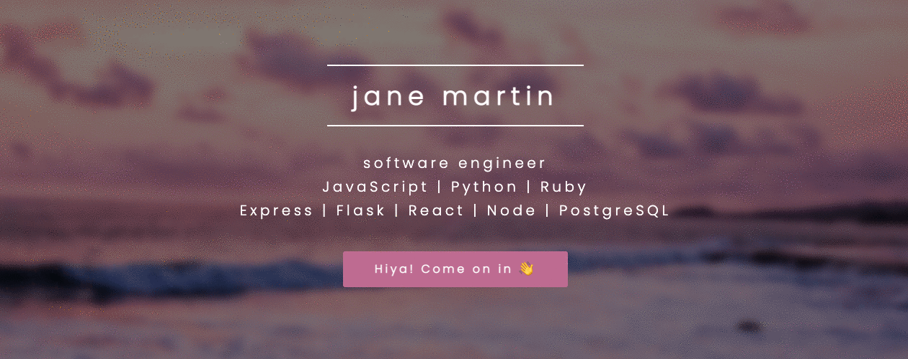

# Welcome! 👩‍💻

## Menu

[Visit My Portfolio](http://www.jemcodes.com/) 

[Meet The Dev](#Meet-The-Dev)

[Credits](#Credits)

---

## Meet The Dev

Hiya, I'm jane! 👋

Programming brings together my passions for building, creating, and problem-solving. Before coming to the coding world, I worked several lifetimes' worth of creative and analytical careers, from founding and managing companies to voiceover work to digging deep into disability law - and almost everything else in between. As a multipotentialite, I'm thrilled to see where this programming journey takes me!

## 
 Find me online: [Portfolio](http://www.jemcodes.com/) • [Resume](http://resume.jemcodes.com/) •  [Linkedin](https://www.linkedin.com/in/jemcodes/)

---

|  |  |
| --- | --- |
| | 

|  |  |  |
| --- | --- | --- |
| Full-Stack Solo Projects |  | 
| Full-Stack Group Projects |  |  |
| Personal Mini-Projects |  |  |
| Contributions |  |

---

## 
 👇 take a peek inside my toolchest 🧰 

 Languages 

 

 Frameworks & Libraries 

 

 Design 

 

 Databases 

 

 Hosting/SaaS 

 

 Version Control 

 

 Current IDE 

 

---

 

### Credits:
Design Template: Spectral by HTML5 UP

html5up.net | aj@lkn.io | @ajlkn

Free for personal and commercial use under the CCA 3.0 license (html5up.net/license)

Demo Images: Unsplash (unsplash.com)

Icons: Font Awesome (fontawesome.io)

Other:

jQuery (jquery.com)

Scrollex (github.com/ajlkn/jquery.scrollex)

Responsive Tools (github.com/ajlkn/responsive-tools)