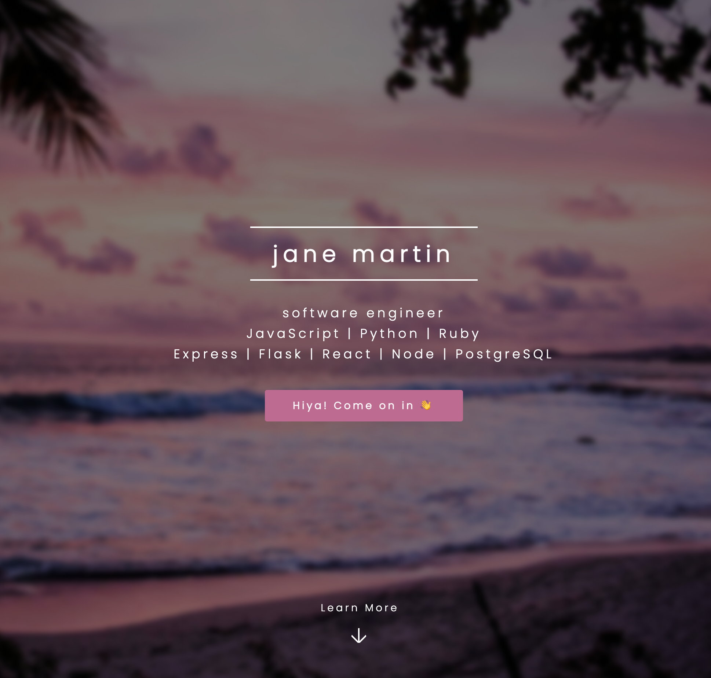

# Welcome! 👩‍💻

## Menu

[Visit My Portfolio](http://www.jemcodes.com/) 

[Meet The Dev](#Meet-The-Dev)

[Credits](#Credits)

---

## Meet The Dev

Hiya, I'm jane! 👋

Programming brings together my passions for building, creating, and problem-solving. Before coming to the coding world, I worked several lifetimes' worth of creative and analytical careers, from founding and managing companies to voiceover work to digging deep into disability law - and almost everything else in between. As a multipotentialite, I'm thrilled to see where this programming journey takes me!

You can find me right here on [Github](https://github.com/jemcodes), over on [Linkedin](https://www.linkedin.com/in/jemcodes/), or [check out my resume](http://resume.jemcodes.com/) 

---

### Credits:
Design Template: Spectral by HTML5 UP

html5up.net | aj@lkn.io | @ajlkn

Free for personal and commercial use under the CCA 3.0 license (html5up.net/license)

Demo Images: Unsplash (unsplash.com)

Icons: Font Awesome (fontawesome.io)

Other:

jQuery (jquery.com)

Scrollex (github.com/ajlkn/jquery.scrollex)

Responsive Tools (github.com/ajlkn/responsive-tools)